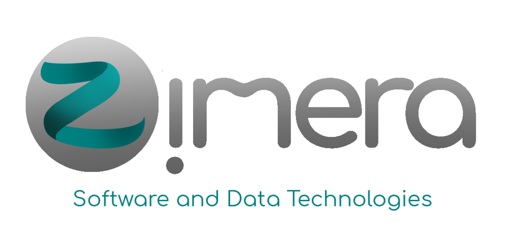

# Zimera School - School of Maker in Software and Data Technologies

## Tentang 

Repo ini digunakan untuk segala hal yang terkait dengan salah satu aktivitas di Zimera Systems yaitu **School of Maker in Softwware and Data Technologies**. Para pembelajar yang menginginkan untuk mempelajari teknologi software dan data di Zimera Systems bisa mulai dari [Panduan Umum](panduan-umum/). Setelah itu bisa masuk ke [https://github.com/zimera-school/materi-pembelajaran](materi-pembelajaran).

Semua materi yang terdapat pada Zimera Systems mempunyai lisensi Apache 2.0 (untuk software) dan CC-BY-SA 4.0 Internasional untuk materi pembelajaran.

## Kontak

**Dr. Bambang Purnomosidi D. P.**

**_Zimera Systems_**

Dusun Medelan - RT 01, Umbulmartani, Ngemplak, Sleman, DIY

https://www.google.com/maps/place/Zimera+Systems/@-7.6975303,110.43921,17z/data=!3m1!4b1!4m5!3m4!1s0x2e7a5d7cc40e8871:0x2d44da15f0b3781e!8m2!3d-7.6975303!4d110.4413987

E-mail: zimera.systems@gmail.com

