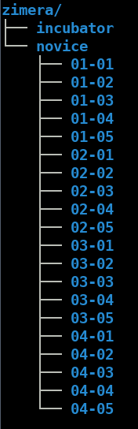

# Proses Pendidikan - Sekolah *Maker* untuk Tema Spesifik

## Pendahuluan

Sekolah *Maker* untuk tema spesifik ini merupakan sekolah yang menekankan pada proses pembelajaran seperti halnya proses yang terdapat pada [*maker education*](https://en.wikipedia.org/wiki/Maker_education), tetapi dalam jangka waktu yang relatif lebih pendek dengan tema khusus tertentu. 

## Ketentuan Umum

* Pendidikan dilaksanakan pada hari kerja (senin - jumat) dengan default dua kali pertemnuan dalam seminggu (sekali pertemuan 2 jam) selama satu bulan untuk latihan dan pengerjaan kasus. Secara default, ada 8 kali pertemuan tatap muka. Lebih dari 8x sangat dimungkinkan, selama masih dalam jangka waktu 1 bulan.
* Hari dan jam tatap muka disepakti antara mentor dan pembelajar.
* Peserta harus membawa laptop sendiri, disarankan memory minimal 8 GB, OS yang didukung hanya Linux (terutama Ubuntu), siswa boleh menggunakan OS apapun, tetapi jika tidak sesuai dengan yang didukung (Ubuntu), tugas siswa sendiri untuk mengelola dan mencari resources serta solusi sendiri terkait OS tersebut (misalnya untuk instalasi software, dan lain-lain).
* Kehadiran sifatnya mutlak. Ketidakhadiran akan menjadi perhatian khusus dan bisa mengarah ke dihentikannya peserta dari proses pendidikan. Masalah seperti ini akan menjadi perhatian internal dan akan dirapatkan oleh internal Zimera untuk tindak lanjut dari kondisi tersebut.
* Waktu untuk beribadah tidak boleh diganggu. Siswa dipersilahkan meninggalkan kelas untuk mengerjakan ibadah. Jam untuk ibadah ini tidak ditulis secara khusus tetapi siswa dipersilahkan melaksanakan sesuai dengan jam masing-masing.
* Siswa diminta semaksimal mungkin berkontribusi ke proyek-proyek open source yang ada di GitHub.

## Tahap Pendidikan

Tahap pendidikan ada 2:

* Tahap *novice*: siswa dianggap mempunyai cukup dasar untuk masuk ke proses. Tahap ini berisi pemberian teori, praktik, dan latihan intensif (1 bulan pertama) dengan tujuan untuk membentuk mental dan *skill* sesuai materi.
* Tahap *incubator*: siswa dianggap siap untuk masuk ke industri. Pada tahap ini, siswa akan diminta untuk mengerjakan kasus yang dicari dan dibuat sendiri solusinya oleh siswa dengan menggunakan materi yang telah diajarkan pada tahap *novice*.

### Novice

_Tujuan_

Memberikan dasar teori dan praktik yang kuat terhadap materi

_Aktivitas Belajar_

Setiap hari dan jam yang disepakari, akan diberikan materi dan siswa diminta untuk mengerjakan latihan serta kasus yang sudah ditetapkan pada materi pembelajaran. Setelah selesai, hasil untuk setiap hari di-push ke repo GitHub dengan nama repo **zimera**. Pada repo tersebut, buat direktori `novice` dan `incubator`. Pada direktori `novice`, buat direktori sesuai dengan minggu dan hari pelaksanaan dari materi pembelajaran:

```
Minggu-Hari
```

- Minggu: Minggu saat pengerjaan (2 digit)
- Hari: Hari saat pengerjaan (2 digit)

Contoh:

`02-03`: repo untuk minggu ke `2`, hari ke `3 (rabu)`.

Pada repo tersebut, buat `README.md` dengan isi minimal:

- Judul: tentang materi hari tersebut
- Oleh: nama siswa
- Tanggal
- Ringkasan materi
- Penjelasan tentang isi repo
- Lisensi

Pada repo tersebut, isikan juga berbagai hasil file yang dikerjakan pada hari itu dengan struktur bebas. File serta strukturnya dijelaskan di dalam file `README.md` di atas.

Berikut adalah contoh direktori yang dibuat:



### Incubator - Initiator

Pada tahap ini, siswa membuat software. Hasil akhir dari proses ini adalah software *open source* yang diletakkan pada repo Git (GitHub) serta *deployment* dari software tersebut (di Google PlayStore untuk aplikasi Android, di DockerHub untuk image Docker, binary release di Github Releases, dan lain-lain). Software harus direncanakan dengan baik dalam bentuk milestones dan tiket-tiket untuk milestones (dari awal sampai rilis). File `README.md` diletakkan pada repo untuk menjelaskan tentang isi dari repo. Arsitektur software, *milestones*, dan dokumentasi tentang software tersebut diletakkan di berbagai file berformat Markdown di direktori `docs`.

